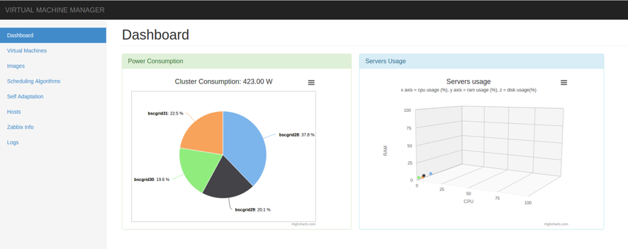
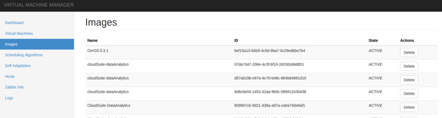
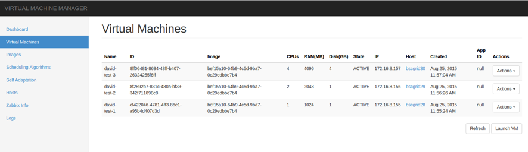

# Demiurge

Bringing order to the (IaaS) Cloud

## About

_Demiurge_ is an Infrastructure-as-a-Service (IaaS) computing resources manager. It enables the optimization of the
management of virtual resources in order to maximise business-level objectives. Namely performance maximisation, price
minimization and, this is where we focus in, maximization of the energy and ecological efficiency.

_Demiurge_'s main features are:

* Support for user-defined scheduling policies as implementations of
  [OptaPlanner](https://github.com/droolsjbpm/optaplanner)'s scoring functions.
* Modularity: the _Demiurge_'s core can be connected with different infrastructures and services, to be adapted for
  different environments.
* Support for different Infrastructure managers. Currently [OpenStack](https://github.com/openstack/openstack).
  Planned: [Kubernetes](http://kubernetes.io/).
* Support for different Infrastructure Monitoring backends. Currently [Zabbix](https://github.com/zabbix/zabbix)
  and [Ganglia](https://github.com/ganglia).
* Easy management through a clean graphical user interface (see _Screenshots_ section)

## Repository structure

* `core` defines the core functionalities, models and interfaces of _Demiurge_.
* `drivers` implements the drivers for different infrastructure and monitoring managers.
* `assemblies` contains subprojects with different configurations of _Demiurge_, plus some extra code to adapt
  it to different environments.
* `client` implements a simple REST client to facilitate the integration of _Demiurge_.
* `frontend` contains subprojects for GUI and REST services (WIP).

## Some screenshots

Dashboard:

Listing virtual images:

Listing Virtual Machines instances:

## How to compile and run

To compile:

	mvn clean install -P <profile>
	
Where `profile` can be `ascetic` or `renewit`.

To run:

	java -jar dist/target/demiurge.jar

## TO DO:

* Add documentation about:
	- Creating an own assembly (beans.xml)
		- per-project branding
	- Configuring demiurge's properties file
	- _Demiurge_'s core architecture
	- Appending new OptaPlanner policies
	
## Credits

Core contributors:

* [Mario Macias](http://github.com/mariomac)
* [David Ortiz](http://github.com/davidor)
* [Mauro Canuto](https://github.com/maurocanuto)

_Demiurge_ is possible thanks to the next open source projects:

* [Spring framework](https://github.com/spring-projects/spring-framework)
* [OptaPlanner](https://github.com/droolsjbpm/optaplanner)
* [JClouds](https://github.com/jclouds/jclouds)
* [AngularJS](https://github.com/angular/angular)
* And a large number of FOSS projects (for more detail, check the `pom.xml` files :bowtie:)

This work is supported by the European Commission under FP7-SMARTCITIES-2013 contract 608679 (RenewIT)
and FP7-ICT-2013-10 contracts 610874 (ASCETiC) and 610456 (EuroServer).

